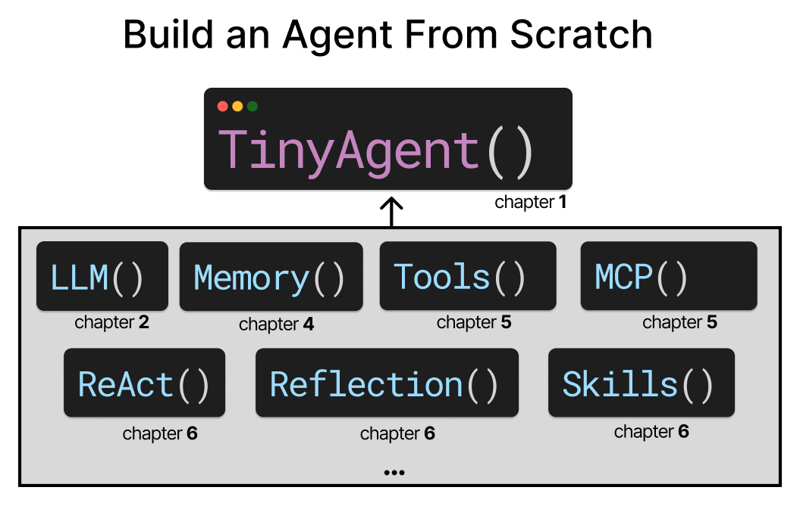
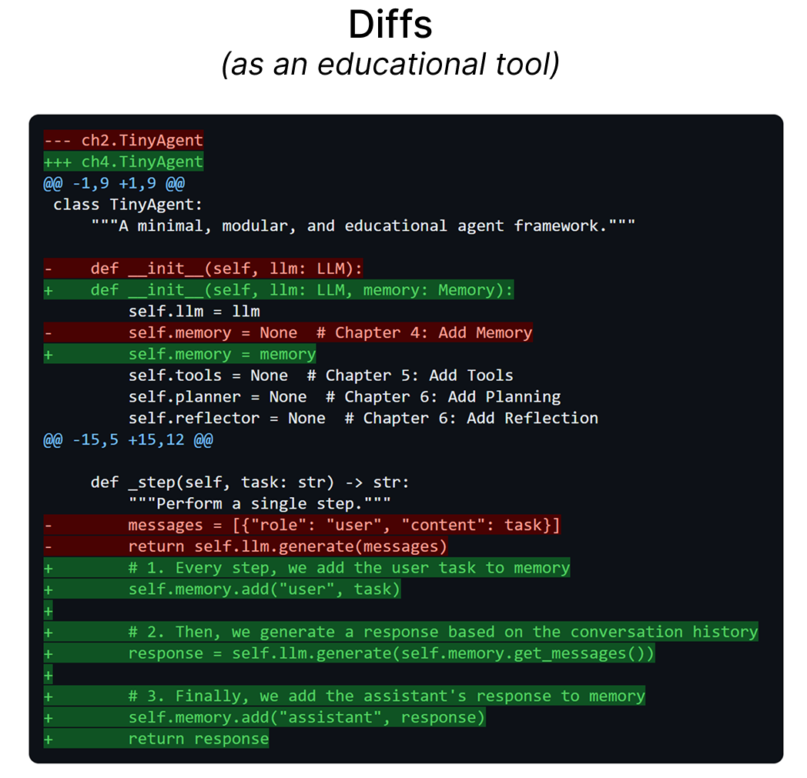

# An Illustrated Guide to AI Agents

<a href="https://www.linkedin.com/in/mgrootendorst/"></a>
<a href="https://www.linkedin.com/in/jalammar/"></a>

Welcome! In this repository you will find the code for the book [An Illustrated Guide to AI Agents](https://www.amazon.com/Hands-Large-Language-Models-Understanding/dp/1098150961) written by [Maarten Grootendorst](https://www.linkedin.com/in/mgrootendorst/) and [Jay Alammar](https://www.linkedin.com/in/jalammar/). In this repository, you will:<br> 

<p align="center"><b><i>"Build an Agent From Scratch!"</i></b></p>

You will build your own Agentic Framework from the ground up using nothing more than three dependencies; `LiteLLM`, `MCP`, and `pygments` (for nice styling 😉).

Through the visually educational nature of this book and with **more than 450 custom made figures**, learn the practical tools and concepts you need to use AI Agents today!

<a href=""></a>

<br>

The book is available on:

* [Amazon](...)
* [Shroff Publishers (India)](...)
* [O'Reilly](https://learning.oreilly.com/library/view/an-illustrated-guide/9798341662681/)
* [Kindle](...)
* [Barnes and Noble](...)
* [Goodreads](...)

## Table of Contents - Build a `TinyAgent` from Scratch!

The code examples in this repo are used for you to start building a `TinyAgent` entirely from scratch, using nothing more than LLM calls. With only one dependency (`LiteLLM`), you will learn how to create your own Agent that has memory, tools, and autonomy! 

All examples can be run in Google Colab for **free** using their T4 GPU. You have options for running everything either locally or on the cloud without any additional costs involved.


| Chapter  | Notebook  |
|---|---|
| Chapter 1: Introduction to AI Agents  | [](...)   |
| Chapter 2: Large Language Models  | [](...)  |
| Chapter 3: Reasoning Large Language Models  | No code  |
| Chapter 4: Memory  | [](...)  |
| Chapter 5: Tools  | [](...)  |
| Chapter 6: Planning  | [](...)  |
| Chapter 7: Evaluation | [](...)  |
| Chapter 8: Multi-Agent Collaboration  | [](...)  |
| Chapter 9: Multimodal Understanding  | [](...)  |
| Chapter 10: Multimodal Generation  | No code  |
| Chapter 11: Coding Agents  | No code  |
| Chapter 12: Efficient Large Language Models  | No code  |

> [!TIP]
> You can check the [setup](.setup/) folder for a quick-start guide to install all packages locally.


## Reviews

TBA

## A Unique Way of Learning

We wanted to do something special this time around and allow readers to **Build an Agent From Scratch**! However, we did not stop there and wanted the act of building the Agent to be a modular experience that enhances the learning experience. By iteratively adding components, one at a time, it becomes much more intuitive how an Agent actually works.

We decided to combine this with creative (if we say so ourselves) ways to explain what is happening and how each added component affects your `TinyAgent`!






## Citation

Please consider citing the book if you consider it useful for your research:

```
@book{illustrated-agents-book,
  author       = {Maarten Grootendorst and Jay Alammar},
  title        = {An Illustrated Guide to AI Agents},
  publisher    = {O'Reilly},
  year         = {2026},
  isbn         = {},
  url          = {https://www.oreilly.com/library/view/an-illustrated-guide/9798341662681/},
  github       = {}
}
```